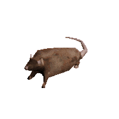
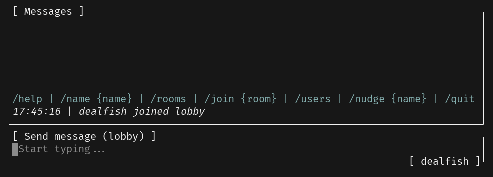
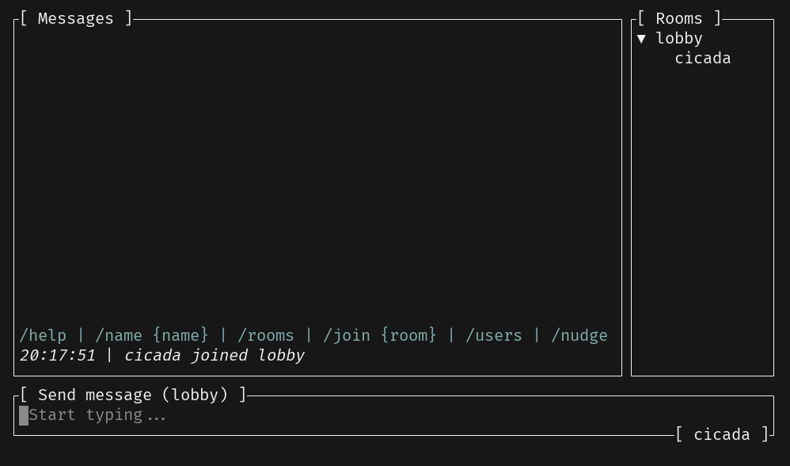

# A little bit about me

## _Orhun Parmaksız_

<!-- pause -->

🐁 Open Source Developer (`github.com/orhun`)

🦀 Creator of **git-cliff**, binsider, kmon, systeroid…

🐭 Chef de Cuisine @ **Ratatui**

📦 Package Maintainer @ Alpine & **Arch Linux** (btw)

`https://orhun.dev`



<!-- end_slide -->

# What will you build?

<!-- pause -->

A terminal chat application that supports sending messages, files, and images.


<!-- end_slide -->

## Goals

<!-- pause -->

- Get familiar with the fundamentals of [Ratatui](https://ratatui.rs).
- Learn how to incorporate widgets and structure your application.
- Understand the best practices of building TUI applications in Rust.
- Have fun!


<!-- end_slide -->

# Getting started

<!-- pause -->

1. Install Rust ([](https://rustup.rs))

2. Install a code editor (w/ `rust-analyzer`)

3. Install a good terminal emulator (i.e. `wezterm`)

4. Clone this repository:

```bash
git clone https://github.com/orhun/rustlab2024-ratatui-workshop
```

<!-- end_slide -->

## Chapters

<!-- pause -->

0. Introduction
1. Initializing the project
2. Initializing the TUI
3. Server connection
4. Message list
5. Text input (w/ `tui-textarea`)
6. Room list (w/ `tui-tree-widget`)
7. Help popup
8. File explorer (w/ `ratatui-explorer`)
9. Image preview (w/ `ratatui-image`)
10. Markdown preview (w/ `tui-markdown`)
11. Terminal effects (w/ `tachyonfx`)
12. Logging (w/ `tui-logger`)
13. Testing (w/ `insta`)
14. End (& more???)

<!-- end_slide -->

## Format

<!-- pause -->

This is a hands-on workshop.

It consists of chapters that build upon each other.

Each chapter is in its own branch:

- `chapter-N`: Contains the code with incomplete parts.
- `chapter-N-solution`: Contains the full solution to move on to the next chapter.

Replace `N` with the chapter number (e.g. `chapter-5`)

<!-- end_slide -->

There are two ways of participation:

<!-- pause -->

1\. Code along with me:

```bash
git merge origin/chapter-1

# and when you are done:
git merge origin/chapter-1-solution

# or use -X theirs to discard your custom changes
git merge -X theirs origin/chapter-1-solution
```

<!-- pause -->

2\. Follow along the solutions:

```bash
git merge origin/chapter-1-solution
```

And always ask questions!

<!-- end_slide -->

## Chapter 0

<!-- pause -->

### Repository structure

- `server`: A TCP server that handles the communication between clients.
- `common`: Shared types (e.g. commands, events) for the server and client.

<!-- pause -->

### Run the server

```sh
cargo run -p server
```

<!-- pause -->

### Connect to the server

```sh
nc 127.0.0.1 42069
```

<!-- end_slide -->

### Commands

| Command         | Syntax                    | Description                                 |
| --------------- | ------------------------- | ------------------------------------------- |
| Help            | `/help`                   | Displays help information                   |
| Change Username | `/name <username>`        | Changes the username to `<username>`        |
| List Rooms      | `/rooms`                  | Lists available chat rooms                  |
| Join Room       | `/join <roomname>`        | Joins the specified `<roomname>`            |
| List Users      | `/users`                  | Lists users in the current room             |
| Send File       | `/file <filename> <data>` | Sends a file with `<filename>` and `<data>` |
| Nudge User      | `/nudge <username>`       | Sends a nudge to `<username>`               |
| Quit            | `/quit`                   | Exits the chat                              |

<!-- pause -->

### Architecture

See the chapter 0 documentation.

<!-- end_slide -->

## Chapter 1

> Create the project

```bash
cargo new tui
```

```bash
git merge origin/chapter-1
```

<!-- end_slide -->

## Chapter 2

> Create the TUI

1. Add dependencies
2. Create the `App` struct
3. Implement the `run` method (\*)

```bash
git merge origin/chapter-2
```

<!-- end_slide -->

## Chapter 3

> Connect to the server

1. Parse command-line arguments
2. Create a TCP stream
3. Read server events (\*)

```bash
git merge origin/chapter-3
```

<!-- end_slide -->

## Chapter 4


> Display the message list

1. Create a `MessageList` struct
2. Implement the `Widget` trait (\*)
3. Render the message list
4. Handle server events

```bash
git merge origin/chapter-4
```

<!-- end_slide -->

## Chapter 5



> Add text input

1. Add the `tui-textarea` dependency
2. Create a `TextArea` (\*)
3. Handle text input events (\*)
4. Send messages to the server (\*)
5. Render the text input (\*)

```bash
git merge origin/chapter-5
```

<!-- end_slide -->

## Chapter 6


> Add room list

1. Add the `tui-tree-widget` dependency
2. Create a `RoomList` struct
3. Implement the `Widget` trait (\*)
4. Handle room events
5. Render the room list (\*)

```bash
git merge origin/chapter-6
```

<!-- end_slide -->

## Chapter 7


> Add help popup

1. Create a new channel for events
2. Create a `HelpPopup` struct
3. Implement the `Widget` trait (\*)
4. Handle help events (\*)
5. Define the key bindings (\*)
6. Handle popup events (\*)
7. Render the popup

```bash
git merge origin/chapter-7
```

<!-- end_slide -->

## Chapter 8



> Add file explorer

<!-- end_slide -->

> Add file explorer

1. Add the `ratatui-explorer` dependency
2. Refactor popup module
3. Create a `FileExplorer` popup (\*)
4. Handle popup input events (\*)
5. Render the file explorer (\*)
6. Send files to the server (\*)

```bash
git merge origin/chapter-8
```

<!-- end_slide -->

## Chapter 9


> Add image preview

<!-- end_slide -->

> Add image preview

1. Make `MessageList` stateful (\*)
2. Handle image preview popup (\*)
3. Add the `ratatui-image` dependency
4. Render the images (\*)
5. Render the popup (\*)

```bash
git merge origin/chapter-9
```

<!-- end_slide -->

## Chapter 10


> Add markdown preview

<!-- end_slide -->

> Add markdown preview

1. Add the `tui-markdown` dependency
2. Create a `MarkdownPreview` popup (\*)
3. Render the markdown (\*)
4. Render the popup (\*)

```bash
git merge origin/chapter-10
```

<!-- end_slide -->

## Chapter 11


> Add terminal effects

<!-- end_slide -->

> Add terminal effects

1. Add the `tachyonfx` dependency
2. Add the `Effect` variant to the `Popup` enum
3. Construct an effect (\*)
4. Render the effect popup (\*)
5. Handle the room events (\*)
6. Handle the events in messages (\*)

```bash
git merge origin/chapter-11
```

<!-- end_slide -->

## Chapter 12


> Add logging

<!-- end_slide -->

> Add logging

1. Add the `tui-logger` and `tracing` dependencies
2. Create a `Logger` struct
3. Implement the `Widget` trait (\*)
4. Add some logging (\*)
5. Initialize logging (\*)
6. Update application to handle show/hide logger
7. Render the logger (\*)

```bash
git merge origin/chapter-12
```

<!-- end_slide -->

## Chapter 13

> Add testing

1. Add the `insta` dependency
2. Write a simple test case (\*)

```bash
git merge origin/chapter-13
```

<!-- end_slide -->

## The End

Congratulations! 🎉 You have completed the workshop and became a real terminal chef! 👨‍🍳🐀

Connect to the public instance:

> cargo run -p tui -- --ip 104.248.254.123

Ideas to extend the application:

- Add a `Scrollbar`
- Support different themes
- Different border styles, colors, etc.

Learn more about Ratatui:

- [Ratatui's website](https://ratatui.rs)
- [Ratatui templates](https://github.com/ratatui/templates)
- [Awesome applications built with Ratatui](https://github.com/ratatui/awesome-ratatui)

Get involved:

- Try building your TUIs with Ratatui and share your experience with us!
- Join our social platforms for questions and help!
- Check out our GitHub repository if you are interested in contributing.

🧀
