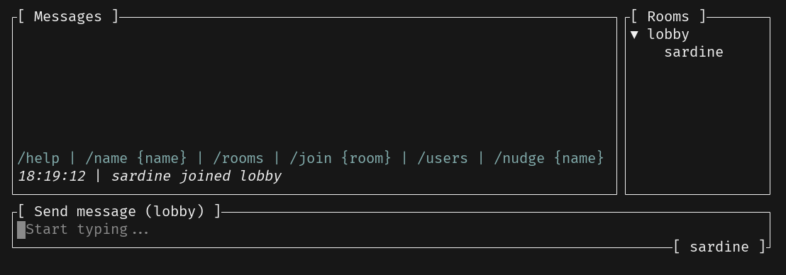

# Room List

We can chat with users and switch between rooms. But how do we know which rooms are available and which users are in the room? We need a way to list all the rooms and users in them.

Let's implement a tree-view widget to display this information.



## Implementing the Widget

Disclaimer: you are free to use the Ratatui's built-in `List` widget for this task as well. But let's spice things up a bit with a tree view 🌲

For this, we will be using the [`tui-tree-widget`](https://github.com/EdJoPaTo/tui-rs-tree-widget) crate:

```sh
cargo add tui-tree-widget@0.22.0
```

Similarly to the `MessageList` widget, let's create a new module `room_list.rs` and implement the `RoomList` struct (don't forget to add `mod room_list;` to `src/main.rs`)

```rust
use common::{RoomName, Username};
use ratatui::{
    buffer::Buffer,
    layout::Rect,
    widgets::{Block, StatefulWidget, Widget},
};
use tui_tree_widget::{Tree, TreeItem, TreeState};

#[derive(Debug, Default)]
pub struct RoomList {
    pub state: TreeState<String>,
    pub rooms: Vec<RoomName>,
    pub users: Vec<Username>,
    pub room_name: RoomName,
}

impl RoomList {
    pub fn push_room(&mut self, room: RoomName) {
        self.rooms.push(room);
    }

    pub fn remove_room(&mut self, room: &RoomName) {
        self.rooms.retain(|r| r != room);
    }
}
```

Here, we are using the `TreeState` to keep track of the tree view's state. We also have `rooms` and `users` vectors to store the room names and users respectively. The `room_name` field is used to highlight the current room. We also have some helper methods to push and remove rooms from the list.

---

🎯 **Task**: Implement the `Widget` trait for `RoomList`.

```rust
impl Widget for &mut RoomList {
    fn render(self, area: Rect, buf: &mut Buffer) {
        // ...
    }
}
```

💡 **Tip:** See the API of the [`tui-tree-widget`](https://docs.rs/tui-tree-widget/) crate.

<details>
<summary><b>Solution</b></summary>

```rust
impl Widget for &mut RoomList {
    fn render(self, area: Rect, buf: &mut Buffer) {
        let leaves: Vec<TreeItem<String>> = self
            .rooms
            .iter()
            .flat_map(|room| {
                if *room == self.room_name {
                    TreeItem::new(
                        room.as_str().to_string(),
                        room.as_str().to_string(),
                        self.users
                            .iter()
                            .map(|user| {
                                TreeItem::new_leaf(user.as_str().to_string(), user.as_str())
                            })
                            .collect(),
                    )
                } else {
                    TreeItem::new(room.as_str().to_string(), room.as_str(), vec![])
                }
            })
            .collect();

        if let Ok(tree) = Tree::new(&leaves) {
            let tree = tree.block(Block::bordered().title("[ Rooms ]"));
            self.state.open(vec![self.room_name.as_str().to_string()]);
            StatefulWidget::render(tree, area, buf, &mut self.state);
        }
    }
}
```

We created the _leaves_ and the tree view from the `rooms` and `users` vectors respectively. We also set the current room as open and render the tree view.

Did you realize that we used `StatefulWidget` here? This is because the `Tree` widget needs to keep track of its state to handle the tree view's expansion and collapse. We are not going to use those features in this chapter, but this is how we implement "stateful" widgets. It will come important later :)

</details>

---

## Using the Widget

Now that we have a `RoomList` widget ready to go, let's use it in our `App`:

```diff
 use crate::message_list::MessageList;
+use crate::room_list::RoomList;

 fn create_text_area() -> TextArea<'static> {
     let mut text_area = TextArea::default();
@@ -23,6 +24,7 @@ pub struct App {
     tcp_writer: Option<FramedWrite<OwnedWriteHalf, LinesCodec>>,
     // UI components (these need to be public as we define the draw_ui method not in a child module)
     pub message_list: MessageList,
+    pub room_list: RoomList,
     pub text_area: TextArea<'static>,
 }

@@ -35,6 +37,7 @@ impl App {
             is_running: false,
             tcp_writer: None,
             message_list: MessageList::default(),
+            room_list: RoomList::default(),
             text_area: create_text_area(),
         }
     }
@@ -61,12 +64,16 @@ impl App {
         Ok(())
     }

+    pub async fn send(&mut self, command: Command) {
+        if let Some(writer) = self.tcp_writer.as_mut() {
+            let _ = writer.send(command.to_string()).await;
+        }
+    }
+
     async fn handle_key_input(&mut self, input: Input) -> anyhow::Result<()> {
         match input.key {
             Key::Esc => {
-                if let Some(writer) = self.tcp_writer.as_mut() {
-                    let _ = writer.send(Command::Quit.to_string()).await;
-                }
+                self.send(Command::Quit).await;
             }
             Key::Enter => self.send_message().await?,
             _ => {
@@ -101,13 +108,20 @@ impl App {
                 ..
             } => self.handle_room_event(room_name, username, event).await,
             ServerEvent::Error(_error) => {}
+            ServerEvent::Rooms(rooms) => {
+                let names = rooms.iter().cloned().map(|(name, _count)| name).collect();
+                self.room_list.rooms = names
+            }
+            ServerEvent::RoomCreated(room_name) => {
+                self.room_list.push_room(room_name);
+            }
+            ServerEvent::RoomDeleted(room_name) => {
+                self.room_list.remove_room(&room_name);
+            }
+            ServerEvent::Users(users) => self.room_list.users = users,
             ServerEvent::Disconnect => {
                 self.is_running = false;
             }
-            ServerEvent::RoomCreated(_) => {}
-            ServerEvent::RoomDeleted(_) => {}
-            ServerEvent::Rooms(_) => {}
-            ServerEvent::Users(_) => {}
         }
         Ok(())
     }
@@ -122,10 +136,15 @@ impl App {
             RoomEvent::Message(_message) => {}
             RoomEvent::Joined(room) | RoomEvent::Left(room) => {
                 self.message_list.room_name = room.clone();
+                self.room_list.room_name = room;
+                self.send(Command::ListUsers).await;
+                self.send(Command::ListRooms).await;
             }
             RoomEvent::NameChange(new_username) => {
                 if username == self.message_list.username {
                     self.message_list.username = new_username;
+                } else {
+                    self.send(Command::ListUsers).await;
                 }
             }
             RoomEvent::Nudge(_) => {}
```

Going through the changes:

1. We added the `RoomList` widget to the `App` struct.
2. We added the `send` method to send commands to the server. This used to be in the `handle_key_input` method.
3. We handle the `Rooms`, `RoomCreated`, `RoomDeleted`, and `Users` variants in server events to update the `RoomList` widget.
4. When a user joins a room, we update the `RoomList` widget with the current room and list the users in the room.

## Rendering the Widget

---

🎯 **Task**: Render the `RoomList` widget in the UI.

💡 **Tip:** Add a new constraint and then call `render_widget` on `self.room_list` in the `draw_ui` method (in `src/ui.rs`):

<details>
<summary><b>Solution</b></summary>

```diff
         frame.render_widget(&self.text_area, text_area);
+
+        let [message_area, room_area] =
+            Layout::horizontal(Constraint::from_percentages([80, 20])).areas(message_area);
+
         frame.render_widget(&mut self.message_list, message_area);
+        frame.render_widget(&mut self.room_list, room_area);
     }
 }
```

We are splitting the `message_area` into two areas and `room_area` will take 20% of the width.

</details>

---

Now, when you run the TUI, you should see the list of rooms on the right side of the window. You can switch between rooms by typing `/join <room_name>` in the text area. 🔥
